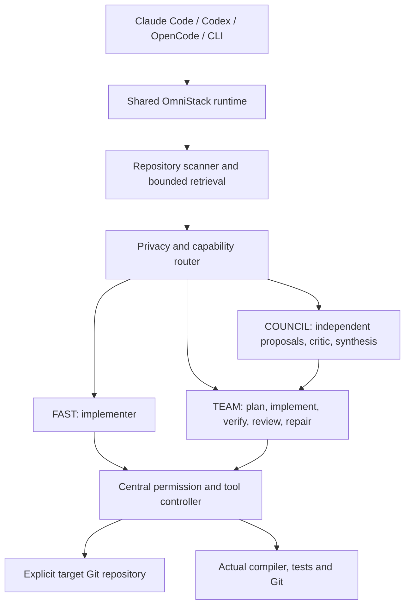

# OmniStack

A universal multi-model engineering layer for coding agents. Install one runtime, register global skills, and use it from Claude Code, Codex, OpenCode, or a terminal in any Git repository.

**Status: initial engineering release, not yet production-certified.** The runtime, provider adapters, councils, controlled file editing, verification and recovery are implemented and tested with deterministic providers. See [validation and remaining limits](docs/STATUS.md). No hosted service, subscription, or specific model is required. The npm package has not been published; name availability remains unverified.

## Why

Engineering benefits from separate planning, implementation and review. OmniStack coordinates those roles across configurable models without moving source code into each application or asking developers to shuttle answers between terminals. Roles never imply a particular provider.



## Install

Requires Node.js 22+ and Git. Clone https://github.com/shankarr1503/omnistack into its own directory, then:

```sh
npm install
npm run build
npm link
omni setup
omni doctor
```

On PowerShell with restricted script execution, use `npm.cmd`. `setup.cmd` performs install/build/setup on Windows. On macOS/Linux use `sh setup` (or `./setup` after setting its executable bit). `npm link` exposes `omni` on PATH; generated host skills also reference the absolute built entrypoint, so they do not depend on PATH.

Prepared distribution after publication:

```sh
npm install -g omnistack
omni setup
```

Do not run that distribution command expecting this unpublished checkout today. Source: https://github.com/shankarr1503/omnistack.

Source checkout, runtime state, and target repositories are distinct:

| Location                                     | Purpose                                                 |
| -------------------------------------------- | ------------------------------------------------------- |
| `~/dev/omnistack` or npm's package directory | Runtime source/build                                    |
| `~/.omnistack` (`OMNI_HOME` override)        | User config, metadata cache, metrics, recovery journals |
| Current Git root (`--repo` override)         | Target project                                          |

Cloning source into `~/.omnistack` is supported; state directories are ignored by Git. The runtime refuses to implement application changes in its global home or its own installation.

## Configure a provider

Edit `~/.omnistack/config.yaml`. Setup detects the presence of OpenAI, Anthropic and OpenRouter credential variables and creates endpoint entries, without copying their values. Discover model IDs, then explicitly declare the capabilities you have verified:

```sh
omni models discover --refresh
omni providers health
```

```yaml
version: 1
providers:
  - id: my-gateway
    type: openai-compatible
    baseUrl: https://your-gateway.example/v1
    apiKeyEnv: MY_GATEWAY_API_KEY
    models:
      - id: your-available-model-id
        capabilities: [coding, toolCalling]
        # Optional actual prices; never synthetic benchmark scores.
        # inputUsdPerMillion: 1
        # outputUsdPerMillion: 3
routing:
  policy: balanced
```

Set the named environment variable in your shell or credential-manager launcher. `.env` files are never automatically loaded. Discovered catalogs do not prove coding/tool support, so unknown capabilities remain empty until configured. See [provider configuration](docs/PROVIDERS.md) and [configuration reference](docs/CONFIGURATION.md).

Local example (Ollama OpenAI-compatible endpoint):

```yaml
providers:
  - id: local
    type: openai-compatible
    baseUrl: http://127.0.0.1:11434/v1
    local: true
    models:
      - id: your-installed-model
        capabilities: [coding, toolCalling]
privacy:
  cloudAllowed: false
```

Ollama, vLLM, LM Studio, llama.cpp, TGI, SGLang and NIM can use compatible endpoints when those deployments support the implemented API. Merely being listed here is not a claim of live certification.

## Use from coding hosts

After `omni setup`, open any repository and start your host:

| Host        | Global skill location              | Typical invocation                       |
| ----------- | ---------------------------------- | ---------------------------------------- |
| Claude Code | `~/.claude/skills/omni-*`          | `/omni-build` or `/omni-review`          |
| Codex       | `~/.agents/skills/omni-*`          | `$omni-build` or `$omni-review`          |
| OpenCode    | `~/.config/opencode/skills/omni-*` | Ask to use `omni-build` or `omni-review` |

All generated wrappers come from the same [canonical skills](skills) and call the same runtime. Host invocation UI may differ by version. Restart an existing session if new skills are not discovered. Setup does not modify `CLAUDE.md`, `AGENTS.md`, or OpenCode configuration.

Paths follow the official [Claude skills documentation](https://code.claude.com/docs/en/skills), [Codex skills documentation](https://learn.chatgpt.com/docs/build-skills), and [OpenCode skills documentation](https://opencode.ai/docs/skills/). Claude's config-directory and OpenCode's XDG override are supported.

## Standalone workflows

```sh
cd /path/to/any/git-repository
omni review
omni review /another/repository
omni plan "Add organization-based authentication"
omni council "Design a caching architecture"
omni run --mode team --allow-write --allow-commands "Add Redis caching"
omni build --allow-write "Implement a pagination helper"
omni security
omni test --allow-commands
omni ship --allow-commands
```

`omni init` is optional. It creates only `.omni/` configuration and project memory; it never copies runtime source or dependencies. Existing files survive repeated initialization. A clean clone can be reviewed immediately.

Commands: `setup`, `init`, `doctor`, `update`, `uninstall`, `dev-link`, `dev-unlink`, `run`, `plan`, `build`, `architect`, `review`, `debug`, `test`, `council`, `security`, `research`, `optimize`, `ship`, `models`, `models discover`, `providers`, `providers health`, `config`, `usage`, `budget`, `skill list`, `skill run`. Each supports `--help`. Results are structured JSON, also explicitly selectable with `--json`.

## Council and verification

FAST selects a suitable implementer. TEAM plans, implements, verifies, independently reviews when a second eligible model is available, and repairs within a configured limit. COUNCIL collects bounded concurrent proposals, deduplicates them, removes configured identities, critiques contradictions, and synthesizes compatible ideas. A failed participant is excluded and disclosed. One surviving candidate is labeled degraded, never presented as consensus.

The engine uses concise conclusions and validated schemas. It does not request or retain hidden reasoning traces. Anthropic thinking blocks are excluded.

Build/test/typecheck/lint scripts are detected in Node, Rust, Go and Python repositories. Running them requires `--allow-commands`: a test script is arbitrary repository code. Missing or unapproved checks are reported as skipped. Unresolved failures produce `needs-attention`, not a success claim. No workflow commits, pushes, publishes or deploys implicitly.

## Privacy and recovery

Privacy is evaluated before transmission and on subsequent tool reads. Denied paths force local routing conservatively. Models cannot read `.env`, `.git`, private-key files, SSH directories, symlinks, junctions, hard links or paths outside the target. Practical secret redaction is defense in depth, not a guarantee that arbitrary source contains no secrets.

```yaml
privacy:
  cloudAllowed: true
  deniedProviders: []
  paths:
    'src/proprietary/**':
      cloudAllowed: false
budget:
  taskUsd: null
  dailyUsd: null
  councilMaxModels: 4
```

Project config cannot replace trusted endpoints, grant command permission, or relax a user's global privacy restrictions. Models receive only bounded relevant context. Full prompts are not cached. Recovery journals **do contain local pre-edit source**, stored under `OMNI_HOME/state/checkpoints` with owner-only permissions where supported. Protect that directory like your source code.

Writes use expected hashes to reject stale edits and checkpoint preimages before mutation. No reset or automatic discard is used. The CLI recover command previews restoration and refuses to overwrite subsequent user changes. Worktrees are an SDK facility for explicit isolated workers; automatic parallel branch merging is not enabled.

## Maintenance and troubleshooting

- `omni doctor`: runtime, Git, detected hosts, wrappers, credentials availability and provider catalog connectivity. Catalog reachability is not an inference test.
- No eligible models: configure IDs/capabilities after discovery, then inspect privacy restrictions and credentials.
- Commands skipped: use `--allow-commands` only after trusting the repository's scripts. Use a container/VM for untrusted code.
- Update: `omni update` previews, `omni update --apply` updates only the runtime and registrations. Dirty runtime checkouts are refused.
- Uninstall: `omni uninstall` removes only unchanged owned wrappers. For npm, then use `npm uninstall -g omnistack`. Source checkouts and user data are deliberately preserved for manual removal.
- A crashed process can leave `state/execution.lock`: inspect the recorded PID before removing a stale lock. Normal exit releases it.
- Contributions: `omni dev-link` registers this build; rebuild after edits. `omni dev-unlink` removes its unchanged wrappers.

See [CONTRIBUTING.md](CONTRIBUTING.md), [SECURITY.md](SECURITY.md), and [status/roadmap](docs/STATUS.md). Branding is centralized in `src/identity.ts`; package, skill and directory names still require a coordinated rename for compatibility.
