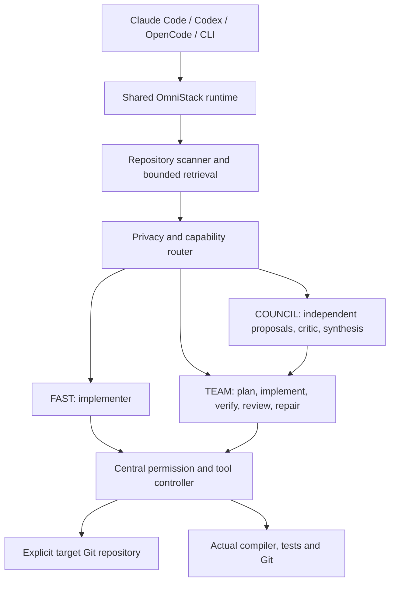

# OmniStack

**Senior-engineer habits for your coding agent, and a whole AI company when you need one.** 16 focused skills that make Claude Code, Codex and OpenCode debug from root causes, write tests first, prove their work, review like a staff engineer, and ship safely. Plus `company`: one command that runs your request through a founder/CEO, a board, product, CTO, design, security, a CFO, an engineering manager, and engineers who build in parallel.

No API key. No runtime. No config. Plain Markdown your agent loads when the task matches.

[](https://github.com/shankarr1503/omnistack/actions/workflows/ci.yml) [](LICENSE)  

## The problem

Coding agents are fast, but they cut the same corners every time:

- They "fix" bugs by guessing and patching symptoms.
- They say **"this should work"** without running anything.
- They write tests after the code, so the tests just repeat what the code does.
- They review diffs by restating them, and miss the bug in the unchanged caller.
- They rename a column in one migration and take production down.

Each skill here encodes what an experienced engineer does instead, as ordered steps, hard rules and a required report format. Your agent loads a skill automatically when its description matches the task.

## Install

**Claude Code** (plugin, recommended):

```text
/plugin marketplace add shankarr1503/omnistack
/plugin install omni@omnistack
```

**Claude Code, Codex and OpenCode** (one command; installs into every host it finds):

```sh
git clone --depth 1 https://github.com/shankarr1503/omnistack && sh omnistack/install.sh
```

Options: `--claude`, `--codex`, `--opencode` to pick hosts, `--project <dir>` to install into one repository (and commit it for your team), `--uninstall` to remove. The installer never overwrites a skill you have edited unless you pass `--force`.

**Manual:** copy any folder from [`library/skills`](library/skills) into `~/.claude/skills/`, `~/.agents/skills/` (Codex) or `~/.config/opencode/skills/`.

Restart your agent session after installing.

## The skills

| Skill                                                      | Use it when                   | What it makes the agent do                                                     |
| ---------------------------------------------------------- | ----------------------------- | ------------------------------------------------------------------------------ |
| [`root-cause`](library/skills/root-cause/SKILL.md)         | Something is broken           | Reproduce → isolate → prove the cause → fix once. No guess-and-check.          |
| [`test-first`](library/skills/test-first/SKILL.md)         | Building or fixing behavior   | Red → green → refactor, with a test that fails for the right reason.           |
| [`prove-it`](library/skills/prove-it/SKILL.md)             | About to say "done"           | Runs the real checks and reports verified vs. not verified. No "should work".  |
| [`plan-it`](library/skills/plan-it/SKILL.md)               | Any non-trivial change        | Small, ordered, verifiable steps naming real files before any edit.            |
| [`ship-review`](library/skills/ship-review/SKILL.md)       | Reviewing a diff or PR        | Hunts real bugs, proves each with a scenario, ranks by severity.               |
| [`threat-check`](library/skills/threat-check/SKILL.md)     | Security review               | Traces attacker input to dangerous sinks; checks authz, secrets, supply chain. |
| [`safe-refactor`](library/skills/safe-refactor/SKILL.md)   | Cleaning up code              | Locks behavior with tests, then moves in small verified steps.                 |
| [`fix-ci`](library/skills/fix-ci/SKILL.md)                 | CI is red                     | Reads the first real error, reproduces locally, fixes instead of retrying.     |
| [`perf-hunt`](library/skills/perf-hunt/SKILL.md)           | Something is slow             | Benchmark → profile → fix the top bottleneck → prove it with numbers.          |
| [`commit-craft`](library/skills/commit-craft/SKILL.md)     | Committing or opening a PR    | Atomic commits and PR descriptions that explain why.                           |
| [`safe-migration`](library/skills/safe-migration/SKILL.md) | Schema or data changes        | Expand-and-contract, lock-aware, batched backfills, rollback plan.             |
| [`upgrade-deps`](library/skills/upgrade-deps/SKILL.md)     | Bumping dependencies          | Changelogs first, small batches, verify each step.                             |
| [`legacy-tests`](library/skills/legacy-tests/SKILL.md)     | Untested code                 | Characterization tests that pin today's behavior before you change it.         |
| [`api-contract`](library/skills/api-contract/SKILL.md)     | Designing or reviewing an API | Caller-first shapes, consistent errors, idempotency, compatibility rules.      |
| [`map-codebase`](library/skills/map-codebase/SKILL.md)     | New repository                | Traces a real flow end to end and produces a map with file references.         |
| [`skill-forge`](library/skills/skill-forge/SKILL.md)       | Writing your own skill        | Turns a workflow into a SKILL.md that triggers reliably.                       |

## Use them

Skills load on their own when your request matches. You can also call them directly:

```text
> The checkout test fails on CI but passes locally. Use fix-ci.
> Use ship-review on this branch before I merge.
> Plan this with plan-it, then build it with test-first.
> /omni:root-cause the export job returns duplicate rows        (Claude Code plugin)
```

Skills compose: `plan-it` → `test-first` → `prove-it` → `ship-review` → `commit-craft` is a full feature workflow.

## What makes a skill good enough to be here

Every skill in this repository must:

1. **Change behavior.** It covers something agents get wrong by default. Generic advice is cut.
2. **Be concrete.** Real commands, tools per ecosystem, ordered steps and explicit "never do" rules.
3. **End with evidence.** A fixed report format separating what was verified from what was not.
4. **Be safe by default.** No destructive action without the user's confirmation.
5. **Be short.** Under 200 lines, so it fits comfortably in context.

CI checks the structure of every skill (frontmatter, naming, a clear "Use when" trigger, length, no runtime dependency, and no broken cross-references). See [CONTRIBUTING.md](CONTRIBUTING.md) to propose a new skill; [`skill-forge`](library/skills/skill-forge/SKILL.md) will help you write it.

## Measured, not just claimed

[`bench/`](bench) runs six realistic tasks (a misleading crash, a spec to implement, a PR with planted bugs, a vulnerable service, a live column rename and a timezone-dependent CI failure) with and without the matching skill, and grades each result with hidden tests the agent never sees.

Two rounds, 48 runs, one model: **95% without skills, 99% with them.** The second round used harder tasks built so the obvious fix is wrong, and the model still found the real cause in nearly every run, with or without skills. What the skills changed was the evidence left behind: on the two debugging tasks, every run with the skill added a regression test (4/4) and no run without it did (0/4); on the test-first task, runs with the skill wrote 20–24 tests against 6–7 without it. See [bench/README.md](bench/README.md) for the method, per-task scores and how to run it yourself.

## OmniStack runtime (optional, advanced)

The skills above need nothing else. OmniStack also ships a multi-model runtime that coordinates planning, implementation and review across models you configure. It needs Node.js 22+ and your own model provider.

**Status: initial engineering release, not yet production-certified.** See [validation and remaining limits](docs/STATUS.md).

### Why

Engineering benefits from separate planning, implementation and review. OmniStack coordinates those roles across configurable models without moving source code into each application or asking developers to shuttle answers between terminals. Roles never imply a particular provider.



### Install

Requires Node.js 22+ and Git. Clone https://github.com/shankarr1503/omnistack into its own directory, then:

```sh
npm install
npm run build
npm link
omni setup
omni doctor
```

On PowerShell with restricted script execution, use `npm.cmd`. `setup.cmd` performs install/build/setup on Windows. On macOS/Linux use `sh setup` (or `./setup` after setting its executable bit). `npm link` exposes `omni` on PATH; generated host skills also reference the absolute built entrypoint, so they do not depend on PATH.

Prepared distribution after publication:

```sh
npm install -g omnistack
omni setup
```

Do not run that distribution command expecting this unpublished checkout today. Source: https://github.com/shankarr1503/omnistack.

Source checkout, runtime state, and target repositories are distinct:

| Location                                     | Purpose                                                 |
| -------------------------------------------- | ------------------------------------------------------- |
| `~/dev/omnistack` or npm's package directory | Runtime source/build                                    |
| `~/.omnistack` (`OMNI_HOME` override)        | User config, metadata cache, metrics, recovery journals |
| Current Git root (`--repo` override)         | Target project                                          |

Cloning source into `~/.omnistack` is supported; state directories are ignored by Git. The runtime refuses to implement application changes in its global home or its own installation.

### Configure a provider

Edit `~/.omnistack/config.yaml`. Setup detects the presence of OpenAI, Anthropic and OpenRouter credential variables and creates endpoint entries, without copying their values. Discover model IDs, then explicitly declare the capabilities you have verified:

```sh
omni models discover --refresh
omni providers health
```

```yaml
version: 1
providers:
  - id: my-gateway
    type: openai-compatible
    baseUrl: https://your-gateway.example/v1
    apiKeyEnv: MY_GATEWAY_API_KEY
    models:
      - id: your-available-model-id
        capabilities: [coding, toolCalling]
        # Optional actual prices; never synthetic benchmark scores.
        # inputUsdPerMillion: 1
        # outputUsdPerMillion: 3
routing:
  policy: balanced
```

Set the named environment variable in your shell or credential-manager launcher. `.env` files are never automatically loaded. Discovered catalogs do not prove coding/tool support, so unknown capabilities remain empty until configured. See [provider configuration](docs/PROVIDERS.md) and [configuration reference](docs/CONFIGURATION.md).

Local example (Ollama OpenAI-compatible endpoint):

```yaml
providers:
  - id: local
    type: openai-compatible
    baseUrl: http://127.0.0.1:11434/v1
    local: true
    models:
      - id: your-installed-model
        capabilities: [coding, toolCalling]
privacy:
  cloudAllowed: false
```

Ollama, vLLM, LM Studio, llama.cpp, TGI, SGLang and NIM can use compatible endpoints when those deployments support the implemented API. Merely being listed here is not a claim of live certification.

### Use from coding hosts

After `omni setup`, open any repository and start your host:

| Host        | Global skill location              | Typical invocation                       |
| ----------- | ---------------------------------- | ---------------------------------------- |
| Claude Code | `~/.claude/skills/omni-*`          | `/omni-build` or `/omni-review`          |
| Codex       | `~/.agents/skills/omni-*`          | `$omni-build` or `$omni-review`          |
| OpenCode    | `~/.config/opencode/skills/omni-*` | Ask to use `omni-build` or `omni-review` |

All generated wrappers come from the same [canonical skills](skills) and call the same runtime. Host invocation UI may differ by version. Restart an existing session if new skills are not discovered. Setup does not modify `CLAUDE.md`, `AGENTS.md`, or OpenCode configuration.

Paths follow the official [Claude skills documentation](https://code.claude.com/docs/en/skills), [Codex skills documentation](https://learn.chatgpt.com/docs/build-skills), and [OpenCode skills documentation](https://opencode.ai/docs/skills/). Claude's config-directory and OpenCode's XDG override are supported.

### Standalone workflows

```sh
cd /path/to/any/git-repository
omni review
omni review /another/repository
omni plan "Add organization-based authentication"
omni council "Design a caching architecture"
omni run --mode team --allow-write --allow-commands "Add Redis caching"
omni build --allow-write "Implement a pagination helper"
omni security
omni test --allow-commands
omni ship --allow-commands
```

`omni init` is optional. It creates only `.omni/` configuration and project memory; it never copies runtime source or dependencies. Existing files survive repeated initialization. A clean clone can be reviewed immediately.

Commands: `setup`, `init`, `doctor`, `update`, `uninstall`, `dev-link`, `dev-unlink`, `run`, `plan`, `build`, `architect`, `review`, `debug`, `test`, `council`, `security`, `research`, `optimize`, `ship`, `models`, `models discover`, `providers`, `providers health`, `config`, `usage`, `budget`, `skill list`, `skill run`. Each supports `--help`. Results are structured JSON, also explicitly selectable with `--json`.

### Council and verification

FAST selects a suitable implementer. TEAM plans, implements, verifies, independently reviews when a second eligible model is available, and repairs within a configured limit. COUNCIL collects bounded concurrent proposals, deduplicates them, removes configured identities, critiques contradictions, and synthesizes compatible ideas. A failed participant is excluded and disclosed. One surviving candidate is labeled degraded, never presented as consensus.

The engine uses concise conclusions and validated schemas. It does not request or retain hidden reasoning traces. Anthropic thinking blocks are excluded.

Build/test/typecheck/lint scripts are detected in Node, Rust, Go and Python repositories. Running them requires `--allow-commands`: a test script is arbitrary repository code. Missing or unapproved checks are reported as skipped. Unresolved failures produce `needs-attention`, not a success claim. No workflow commits, pushes, publishes or deploys implicitly.

### Privacy and recovery

Privacy is evaluated before transmission and on subsequent tool reads. Denied paths force local routing conservatively. Models cannot read `.env`, `.git`, private-key files, SSH directories, symlinks, junctions, hard links or paths outside the target. Practical secret redaction is defense in depth, not a guarantee that arbitrary source contains no secrets.

```yaml
privacy:
  cloudAllowed: true
  deniedProviders: []
  paths:
    'src/proprietary/**':
      cloudAllowed: false
budget:
  taskUsd: null
  dailyUsd: null
  councilMaxModels: 4
```

Project config cannot replace trusted endpoints, grant command permission, or relax a user's global privacy restrictions. Models receive only bounded relevant context. Full prompts are not cached. Recovery journals **do contain local pre-edit source**, stored under `OMNI_HOME/state/checkpoints` with owner-only permissions where supported. Protect that directory like your source code.

Writes use expected hashes to reject stale edits and checkpoint preimages before mutation. No reset or automatic discard is used. The CLI recover command previews restoration and refuses to overwrite subsequent user changes. Worktrees are an SDK facility for explicit isolated workers; automatic parallel branch merging is not enabled.

### Maintenance and troubleshooting

- `omni doctor`: runtime, Git, detected hosts, wrappers, credentials availability and provider catalog connectivity. Catalog reachability is not an inference test.
- No eligible models: configure IDs/capabilities after discovery, then inspect privacy restrictions and credentials.
- Commands skipped: use `--allow-commands` only after trusting the repository's scripts. Use a container/VM for untrusted code.
- Update: `omni update` previews, `omni update --apply` updates only the runtime and registrations. Dirty runtime checkouts are refused.
- Uninstall: `omni uninstall` removes only unchanged owned wrappers. For npm, then use `npm uninstall -g omnistack`. Source checkouts and user data are deliberately preserved for manual removal.
- A crashed process can leave `state/execution.lock`: inspect the recorded PID before removing a stale lock. Normal exit releases it.
- Contributions: `omni dev-link` registers this build; rebuild after edits. `omni dev-unlink` removes its unchanged wrappers.

See [CONTRIBUTING.md](CONTRIBUTING.md), [SECURITY.md](SECURITY.md), and [status/roadmap](docs/STATUS.md). Branding is centralized in `src/identity.ts`; package, skill and directory names still require a coordinated rename for compatibility.
